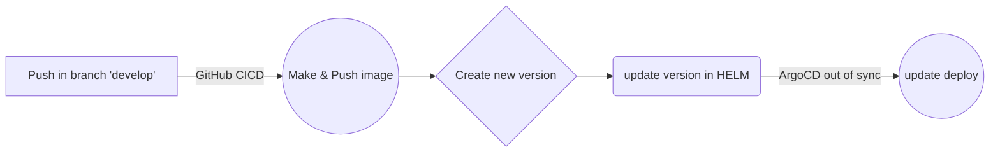

### ЗАДАЧА 8.1 - поки відсутня
 
 ## Telegramm bot

Для використання потрібно зарееструвати бот в телеграмі BotFather та отримати token. 
Для розгортання за допомогою Helm, необхідно завантажити архів релізу [за посиланням](https://github.com/nirev23/t-bot/blob/main/releases/download/v1.0.2/t-bot-1.1.3.tgz)
та розгорнути його на кластері, запустивши команду в теці з разпакованим архівом

    helm install t-bot-1.1.3 ./helm-bot
Після розгортання необхідно передати token, якій ви отримали при реестраціі чатбота у BotFather:

    kubectl set env deploy/t-bot-1.1.3 TELE_TOKEN=<token>
 На данний момент бот реагує на "/start hello" надаючи інформацію про свою версію. Чекайте на нові функціі згодом...
 
Workflow:

